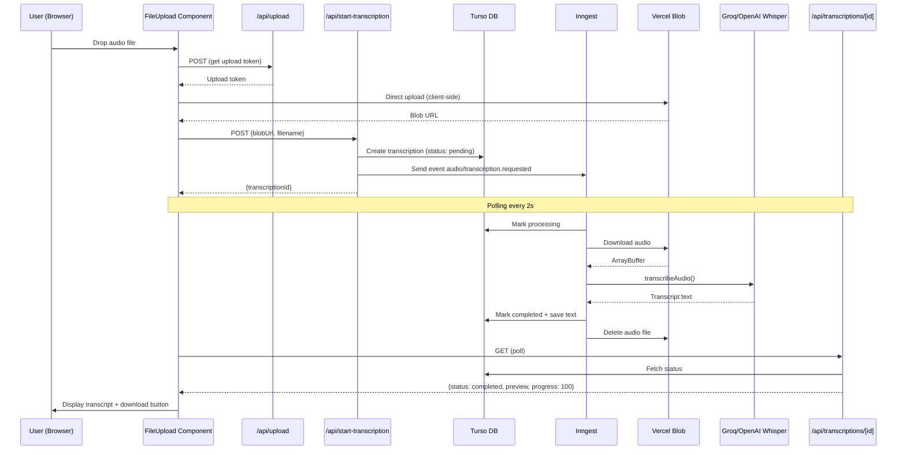
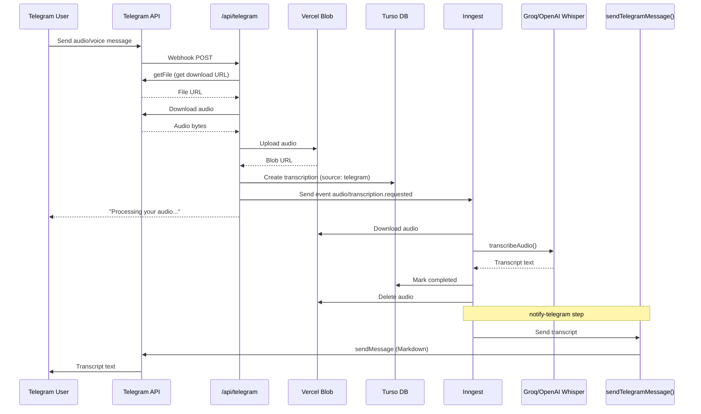
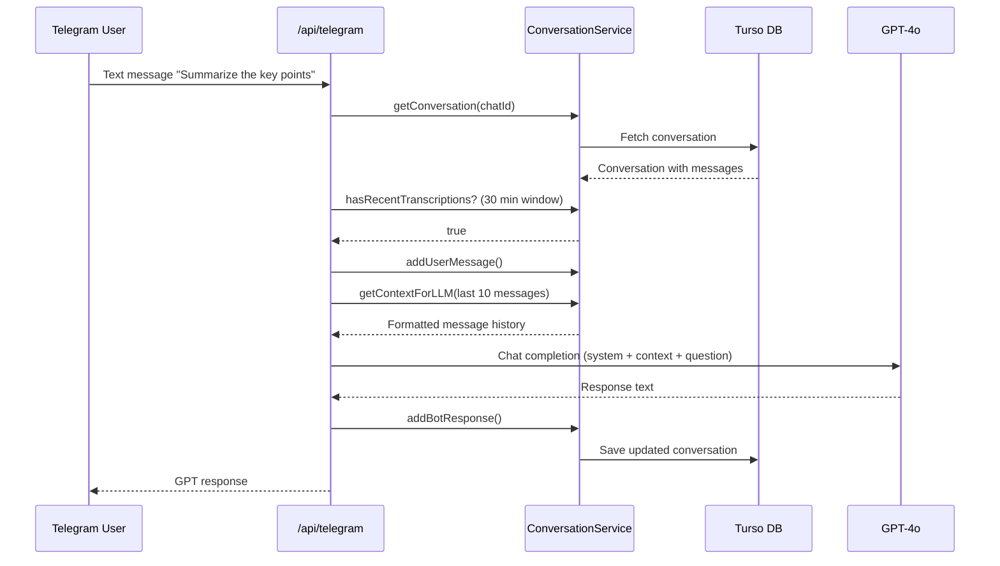
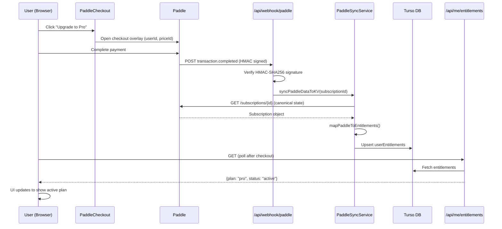
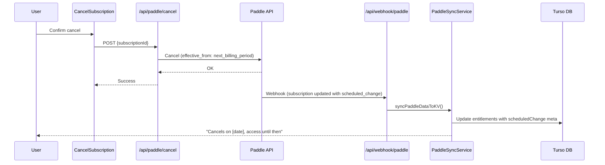

# AudioScribe V2 — Architecture

Audio transcription SaaS that converts audio files to text via Whisper, with a web app and Telegram bot.

## Stack

| Layer | Technology |
|---|---|
| Framework | Next.js 16 (App Router, Turbopack) |
| Language | TypeScript (strict mode) |
| Auth | Clerk |
| Payments | Paddle |
| Database | Turso (managed SQLite) + Drizzle ORM |
| Storage | Vercel Blob |
| Background jobs | Inngest |
| Transcription | Groq `whisper-large-v3-turbo` / OpenAI `whisper-1` (configurable) |
| Chat | OpenAI GPT-4o (Telegram Q&A only) |
| Telegram | Grammy (webhook mode) |
| UI | React 19, Tailwind CSS 4, shadcn/ui |

---

## Directory Structure

```
src/
├── app/
│   ├── layout.tsx                     # Root layout (Clerk, Paddle, SiteHeader)
│   ├── page.tsx                       # Home — hero, file upload, pricing
│   ├── pricing/page.tsx               # Plan comparison + FAQ
│   ├── subscription/page.tsx          # Subscription management dashboard
│   ├── checkout/success/page.tsx      # Post-checkout confirmation
│   ├── about|contact|features/        # Static pages
│   ├── cookies|privacy|terms/         # Legal pages
│   └── api/
│       ├── upload/route.ts            # Vercel Blob client upload tokens
│       ├── start-transcription/route.ts
│       ├── transcriptions/[id]/       # Status polling + transcript download
│       ├── me/entitlements/route.ts   # User subscription data
│       ├── telegram/route.ts          # Grammy webhook
│       ├── inngest/route.ts           # Inngest webhook (GET/POST/PUT)
│       ├── webhook/paddle/route.ts    # Paddle subscription webhooks
│       ├── webhook/clerk/route.ts     # Clerk user webhooks
│       ├── paddle/cancel/route.ts     # Subscription cancellation
│       ├── validate-purchase/route.ts
│       └── health/route.ts
├── components/
│   ├── file-upload.tsx                # Drag-and-drop upload + status polling
│   ├── paddle-provider.tsx            # Paddle.js SDK context
│   ├── paddle-checkout.tsx            # Checkout overlay trigger
│   ├── cancel-subscription.tsx        # Cancellation dialog
│   └── ui/                            # shadcn/ui primitives
├── hooks/
│   └── use-entitlements.tsx           # Client-side entitlements state
├── services/
│   ├── index.ts                       # Singleton instantiation
│   ├── ai/
│   │   ├── index.ts                   # AI module exports
│   │   ├── transcription-ai.service.ts # Whisper transcription (Groq/OpenAI)
│   │   ├── text-ai.service.ts         # Summary + translation (OpenAI)
│   │   ├── job-fit-ai.service.ts      # Resume vs JD analysis (Anthropic)
│   │   ├── providers/
│   │   │   ├── openai.client.ts       # OpenAI client factory
│   │   │   └── anthropic.client.ts    # Anthropic client factory
│   │   ├── prompts/
│   │   │   └── job-fit.prompt.ts      # Job-fit prompt builder
│   │   └── schemas/
│   │       ├── summary.schema.ts      # Summary/translation output schema
│   │       └── job-fit.schema.ts      # Job-fit output schema
│   ├── transcriptions.ts             # Transcription CRUD
│   ├── users.ts                       # User entitlements
│   ├── storage.ts                     # Vercel Blob operations
│   ├── conversation.ts               # Telegram conversation state
│   ├── paddle-sync.ts                # Paddle → entitlements sync
│   ├── chat.ts                        # GPT-4o chat completions
│   ├── telegram.ts                    # Direct Telegram API calls
│   └── __tests__/                     # Service unit tests
├── inngest/
│   ├── client.ts                      # Inngest client (app: m4a-to-notes-v2)
│   ├── events.ts                      # Event definitions
│   └── functions/
│       └── process-transcription.ts   # Main transcription workflow
├── db/
│   ├── schema.ts                      # Drizzle table definitions
│   └── index.ts                       # DB connection singleton
├── lib/
│   ├── errors.ts                      # Error classes (AppError hierarchy)
│   ├── logger.ts                      # JSON structured logger
│   ├── validation.ts                  # Audio file validation
│   ├── types.ts                       # Shared type definitions
│   ├── pricing.ts                     # Plan definitions and pricing
│   ├── utils.ts                       # cn() utility
│   └── constants/
│       └── plans.ts                   # Plan hierarchy + Paddle mappings
├── proxy.ts                           # Clerk middleware config
└── test/
    ├── setup.ts                       # Test logger
    └── db.ts                          # In-memory SQLite for tests
```

---

## Database Schema

Four tables in Turso (SQLite):

```
┌─────────────────────────────────────────────┐
│ transcriptions                              │
├─────────────────────────────────────────────┤
│ id            TEXT PK                       │
│ status        TEXT (pending|processing|     │
│               completed|failed)             │
│ progress      INTEGER (0–100)               │
│ audioKey      TEXT (Vercel Blob URL)         │
│ filename      TEXT                           │
│ source        TEXT (web|telegram)            │
│ transcriptText TEXT                          │
│ preview       TEXT (first 150 chars)         │
│ userMetadata  JSON                           │
│ errorDetails  JSON ({code?, message?})       │
│ createdAt     TEXT                           │
│ startedAt     TEXT                           │
│ completedAt   TEXT                           │
│ updatedAt     TEXT                           │
├─────────────────────────────────────────────┤
│ indexes: status, createdAt                  │
└─────────────────────────────────────────────┘

┌─────────────────────────────────────────────┐
│ userEntitlements                            │
├─────────────────────────────────────────────┤
│ userId        TEXT PK (Clerk user ID)       │
│ plan          TEXT (free|pro|business)       │
│ status        TEXT (none|active|trialing|   │
│               past_due|canceled)            │
│ expiresAt     TEXT                           │
│ features      JSON (string[])               │
│ limits        JSON (Record<string, number>) │
│ createdAt     TEXT                           │
│ updatedAt     TEXT                           │
└─────────────────────────────────────────────┘

┌─────────────────────────────────────────────┐
│ conversations                               │
├─────────────────────────────────────────────┤
│ chatId        TEXT PK (Telegram chat ID)    │
│ data          JSON (ConversationData)       │
│ createdAt     TEXT                           │
│ updatedAt     TEXT                           │
│ expiresAt     TEXT (7-day TTL)              │
├─────────────────────────────────────────────┤
│ index: expiresAt                            │
└─────────────────────────────────────────────┘

┌─────────────────────────────────────────────┐
│ jobs (legacy, unused)                       │
└─────────────────────────────────────────────┘
```

---

## Service Layer

All services are singletons instantiated in `src/services/index.ts`:

| Service | Responsibility |
|---|---|
| `TranscriptionsService` | CRUD for transcription records, status transitions, progress tracking |
| `TranscriptionAiService` | Whisper API calls via Groq or OpenAI (configurable via `TRANSCRIPTION_PROVIDER` env var) |
| `TextAiService` | Transcript summary + translation |
| `JobFitAiService` | Resume-to-job compatibility analysis |
| `StorageService` | Upload/download/delete files in Vercel Blob |
| `UsersService` | User entitlements — get, set (upsert), access checks with plan hierarchy |
| `ConversationService` | Telegram conversation state with 7-day TTL, message history for LLM context |
| `PaddleSyncService` | Webhook → fetch canonical Paddle state → map to entitlements → save |
| `TranscriptionOrchestrator` | Coordinates full transcription workflow (used by Inngest function) |
| `getChatCompletion()` | GPT-4o chat for Telegram Q&A |
| `sendTelegramMessage()` | Direct Telegram Bot API calls (used by Inngest to notify) |

---

## Authentication & Middleware

```
                    ┌──────────────────────────┐
                    │     Clerk Middleware      │
  All requests ────►│      (src/proxy.ts)      │
                    └────────────┬─────────────┘
                                 │
                    ┌────────────┴─────────────┐
                    │                          │
              Clerk-protected           Excluded routes
              (session parsed)          (no Clerk parsing)
                    │                          │
              /api/upload              /api/inngest  ── Inngest signing key
              /api/start-*             /api/webhook/* ── HMAC-SHA256 (Paddle)
              /api/transcriptions/*    /api/telegram ── Bot token query param
              /api/me/*                /api/health
              /api/paddle/*
              All page routes
```

Protected API routes use `auth()` from Clerk to extract `userId`.

---

## Flows

### 1. Web Transcription



### 2. Telegram Transcription



### 3. Telegram Q&A (Chat with Transcriptions)



### 4. Subscription Purchase



### 5. Subscription Cancellation



---

## Inngest: process-transcription

The core background job with 4 idempotent steps:

```
┌──────────────────────────────────────────────────────────────────┐
│  process-transcription (retries: 4, backoff: exponential)       │
├──────────────────────────────────────────────────────────────────┤
│                                                                  │
│  1. fetch-transcription                                          │
│     ├── Load record from DB                                      │
│     ├── Skip if already completed/failed                         │
│     └── Mark status → "processing"                               │
│                                                                  │
│  2. download-and-transcribe                                      │
│     ├── Download audio from Vercel Blob                          │
│     ├── Update progress → 20%                                    │
│     ├── Call Whisper API (Groq or OpenAI)                        │
│     ├── Update progress → 90%                                    │
│     └── Throw NonRetriableError if no speech detected            │
│                                                                  │
│  3. save-and-cleanup                                             │
│     ├── Generate preview (first 150 chars)                       │
│     ├── Mark completed + save transcript                         │
│     └── Delete audio blob                                        │
│                                                                  │
│  4. notify-telegram (conditional)                                │
│     ├── Only if source = "telegram" && chatId exists             │
│     └── Send transcript to Telegram chat (max 4000 chars)        │
│                                                                  │
│  DLQ handler: marks transcription as failed after max retries    │
└──────────────────────────────────────────────────────────────────┘
```

Groq rate limits (20 req/min) are handled by Inngest's built-in retry with exponential backoff.

---

## Access Control

Plan hierarchy: `free (0) < pro (1) < business (2)`

| Feature tier | Required plan | Required status |
|---|---|---|
| `basic` | Any (including no record) | Any |
| `pro` | `pro` or `business` | `active` or `trialing` |
| `business` | `business` | `active` or `trialing` |

Canceled or past_due users lose access to paid tiers.

---

## Environment Variables

| Variable | Used by | Required |
|---|---|---|
| `TURSO_DATABASE_URL` | DB connection | Yes |
| `TURSO_AUTH_TOKEN` | DB connection | Yes |
| `OPENAI_API_KEY` | AiService (if provider=openai), Chat (GPT-4o) | Yes |
| `TRANSCRIPTION_PROVIDER` | AiService | No (defaults to `groq`) |
| `GROQ_API_KEY` | AiService (if provider=groq) | When provider=groq |
| `TELEGRAM_BOT_TOKEN` | Telegram webhook auth + API calls | For Telegram |
| `BLOB_READ_WRITE_TOKEN` | Vercel Blob | Yes |
| `INNGEST_SIGNING_KEY` | Inngest webhook verification | Yes |
| `INNGEST_EVENT_KEY` | Inngest event sending | Yes |
| `PADDLE_API_KEY` | PaddleSyncService | For payments |
| `PADDLE_ENVIRONMENT` | Paddle SDK | For payments |
| `PADDLE_NOTIFICATION_WEBHOOK_SECRET` | Webhook HMAC verification | For payments |
| `NEXT_PUBLIC_CLERK_PUBLISHABLE_KEY` | Clerk client-side | Yes |
| `CLERK_SECRET_KEY` | Clerk server-side | Yes |
| `NEXT_PUBLIC_PADDLE_CLIENT_TOKEN` | Paddle.js SDK | For payments |
| `NEXT_PUBLIC_PADDLE_ENV` | Paddle.js SDK | For payments |
| `NEXT_PUBLIC_POSTHOG_KEY` | Analytics | Optional |

---

## Testing

**Framework:** Vitest with in-memory SQLite (`better-sqlite3`) for DB tests.

```
src/test/db.ts      → Creates in-memory DB with schema applied
src/test/setup.ts   → Silent logger (ERROR level only)
```

Tests live in `__tests__/` directories next to source. Services are tested with real (in-memory) DB, external APIs are mocked with `vi.mock()`.
